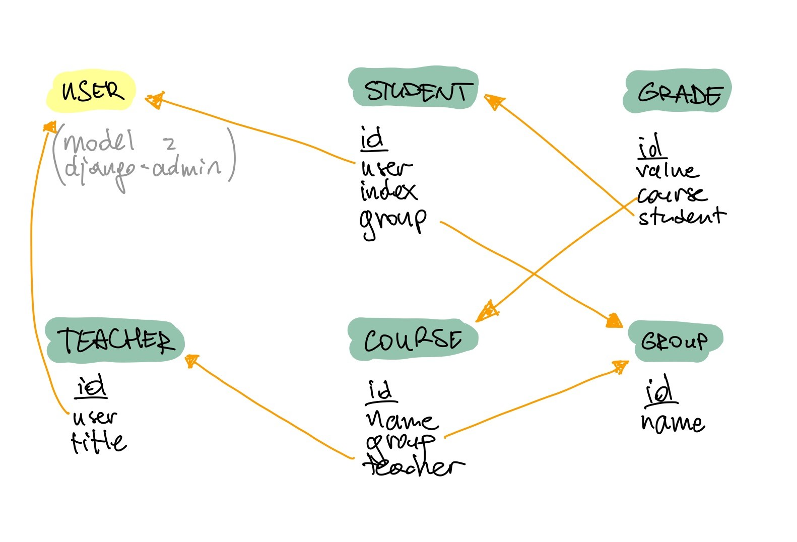

# Extranet

Projekt zaliczeniowy ćwiczeń z przedmiotu Programowanie Obiektowe pod kierownictwem p. Macieja Kotkowskiego.

## Zespół

- Joanna Kędzierska
- Jakub Misiak
- Łukasz Kliś

## Opis projektu

_Extranet_ to projekt w oparciu o framework Django imitujący system wewnętrzny używany przez Wyższą Szkołę
Bankową we Wrocławiu.

### Modele

## Wymagania

- Python w wersji `3.x`.

## Praca w środowisku lokalnym

1. Zainstaluj zależności projektu uruchamiając polecenie `pip install -r requirements.txt`,
1. Uruchom migracje bazy danych uruchamiając polecenie `python manage.py migrate`,
1. Załaduj dane testowe do projektu uruchamiając polecenie `python manage.py loaddata data.json`,
1. Uruchom serwer lokalny uruchamiając polecenie `python manage.py runserver`.
1. Otwórz w przglądarce adres <http://127.0.0.1:8000>.

### Panel administracyjny

Istnieje możliwość skorzystania z wbudowanego w Django panelu administracyjnego. Wystarczy wykonać kroki opisane wyżej,
a następnie wejść na stronę  <http://127.0.0.1:8000/admin/> i zalogować się podając dane użytkownika z odpowiednimi
uprawnieniami (`superuser` / `test`).

### Dane testowe

| Login | Hasło | Dostęp do admina? | Wykładowca? | Student? |
| --- | --- |:---:|:---:|:---:|
| `superuser` | `test` | ✔ | ❌ | ❌ |
| `teacher1` | `tPassword` | ❌ | ✔ | ❌ |
| `teacher2` | `tPassword` | ❌ | ✔ | ❌ |
| `student1` | `sPassword` | ❌ | ❌ | ✔ |
| `student2` | `sPassword` | ❌ | ❌ | ✔ |
| `student3` | `sPassword` | ❌ | ❌ | ✔ |
| `student4` | `sPassword` | ❌ | ❌ | ✔ |
| `student5` | `sPassword` | ❌ | ❌ | ✔ |
| `student6` | `sPassword` | ❌ | ❌ | ✔ |
| `student7` | `sPassword` | ❌ | ❌ | ✔ |
| `student8` | `sPassword` | ❌ | ❌ | ✔ |
| `student9` | `sPassword` | ❌ | ❌ | ✔ |
| `student10` | `sPassword` | ❌ | ❌ | ✔ |
| `student11` | `sPassword` | ❌ | ❌ | ✔ |
| `student12` | `sPassword` | ❌ | ❌ | ✔ |
